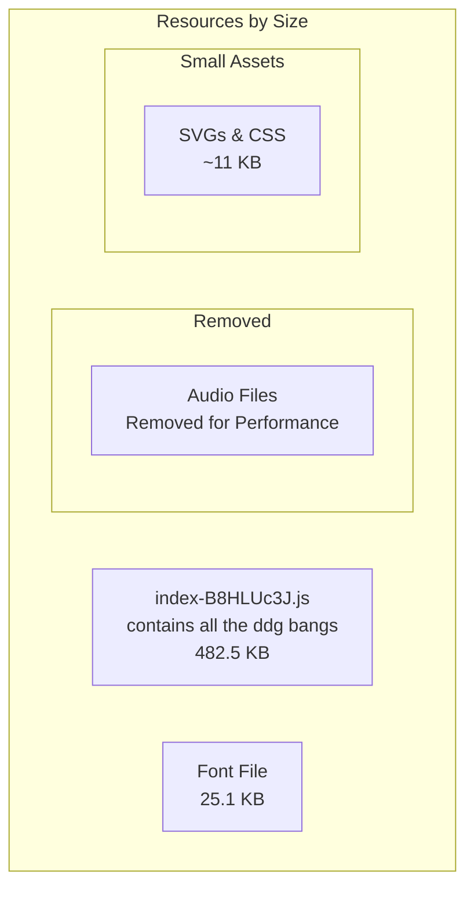
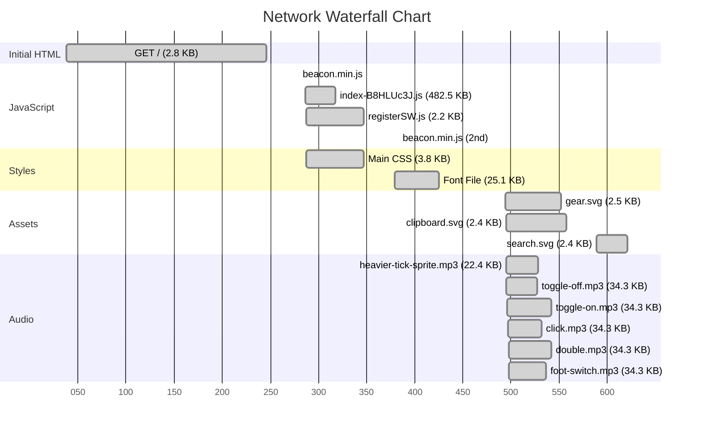

# Unduckified


> This is a fork of [t3dotgg/unduck](https://github.com/t3dotgg/unduck). Check out Theo's hosted version at [unduck.link](https://unduck.link) for the original experience.

## Quick Start

Add this URL as a custom search engine to your browser to use DuckDuckGo's bangs, but faster:

```
https://s.dunkirk.sh?q=%s
```

## How is it that much faster?

DuckDuckGo does their redirects server side. Their DNS is...not always great. Result is that it often takes ages.

I solved this by doing all of the work client side. Once you've went to https://s.dunkirk.sh once, the JS is all cached and will never need to be downloaded again. Your device does the redirects, not me or any other server.

## How is this different from Theo's version again?

This is primarily my personal fork to experiment with PWAs but I do have a few ideas that I would love to add to this.


- [x] Bangs
- [x] Dark Mode
- [x] Settings (for changing default bang and custom bangs)
- [x] ~~Search counter~~ (removed to reduce bundle size)
- [x] [OpenSearch](https://developer.mozilla.org/en-US/docs/Web/XML/Guides/OpenSearch) support
- [x] ~~Search History~~ (removed to reduce bundle size)
- [x] ~~Fancy sounds~~ (removed to reduce bundle size)
- [x] Cute little text animations
- [x] Auto updating bangs file! (I'm using a [GitHub Action](https://github.com/taciturnaxolotl/unduckified/actions/workflows/update-bangs.yaml) to update the bangs file every 24 hours)
- [x] Hashmapped bangs for faster searching
- [x] local font file to avoid google fonts
- [x] redirects to the base page of a bang if there is no query (e.g. `!g` will take you to google.com and `!yt` will take you to youtube.com)
- [x] Suffix bangs (e.g. `ghr! taciturnaxolotl/unduckified` will take you to this github repo)
- [x] Quick settings (e.g. `!settings` or `!` will take you to the settings page)
- [x] Custom local bangs! (thanks to [@ayoubabedrabbo@mastodon.social](https://mastodon.social/@ayoubabedrabbo/114114311682366314) for the suggestion)
- [x] Kagi bangs! We are able to grab the bangs from [kagisearch/bangs](https://github.com/kagisearch/bangs/) and Kagi is far more responsive than DuckDuckGo when it comes to updating their bangs.
- [x] Manual bangs update script! Run `bun run update-bangs` to manually update bangs from Kagi's repository.

I would love to add these but they don't seem possible / feasible at the moment:

- [ ] ~Search suggestions~ (as far as I can tell this essentially impossible to do natively with either firefox or chrome; please correct me if I'm wrong though. In this case I would very much love to be wrong)
- [x] ~Weekly bang checks to ensure that all bangs still work and excludes those that don't~ this ended up being unreliable because of cloudflare rate limiting and switching to kagi bangs helped a lot with this

## Fancy smancy technical graphs 😮

The total size of the app is `518.9 KB` (one time download)

### Resource Breakdown



### Network Performance



## Development

### Updating Bangs

The bangs are automatically updated daily via GitHub Actions, but you can also update them manually:

```bash
# Update bangs from Kagi's repository
bun run update-bangs

# Filter bangs to reduce bundle size (optional)
bun run filter-bangs

# Build the project with updated bangs
bun run build
```

### Bang Filtering Options

To reduce bundle size, you can filter bangs to include only the most essential ones:

- **Minimal** (~12 bangs, 3KB): Only the most essential triggers (Google, YouTube, Wikipedia, Steam, Twitch, Discord)
- **Essential** (~7,000 bangs, 1.4MB): Popular triggers + essential categories + gaming bangs
- **Extended** (~10,000 bangs, 2MB): Essential + shopping, multimedia, news
- **Full** (~11,000 bangs, 2.1MB): Complete Kagi bangs collection

The default is **Essential** which includes gaming bangs and provides a good balance of functionality and performance.

### Available Scripts

- `bun run dev` - Start development server
- `bun run build` - Build for production
- `bun run preview` - Preview production build
- `bun run update-bangs` - Update bangs from Kagi repository
- `bun run filter-bangs` - Filter bangs to reduce bundle size
- `bun run hash` - Generate hashbang.ts from bangs.json
- `bun run check` - Test bangs functionality

## Screenshots

<details>
    <summary>Spoiler Alert: There is both a light and a dark mode 🤯</summary>

### Light Mode


### Dark Mode 💪


</details>

<p align="center">
	
</p>

<p align="center">
	<i><code>&copy 2025-present <a href="https://github.com/taciturnaxolotl">Kieran Klukas</a> forked from <a href="https://github.com/t3dotgg/unduck">t3dotgg/unduck</a></code></i>
</p>

<p align="center">
	<a href="https://github.com/taciturnaxolotl/unduckified/blob/main/LICENSE.md"></a>
</p>
